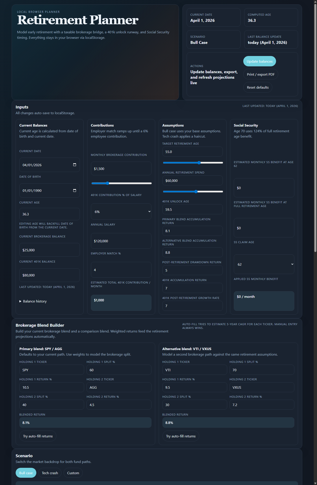
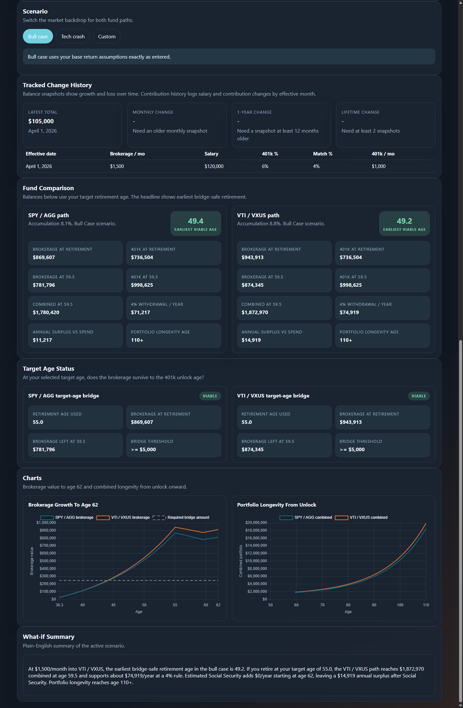

# Retirement Planner

A single-file, browser-only retirement planning app for modeling:

- current brokerage and 401k balances
- ongoing contributions and employer match
- bridge viability before 401k unlock
- Social Security timing
- brokerage portfolio comparisons using two editable ETF/stock blends
- balance history and contribution-history tracking over time

No backend is required. Everything runs locally in the browser and saves to `localStorage`.

## Privacy

This repository is sanitized for public sharing.

- No personal balances, salary, retirement age, spend target, contribution settings, or holdings are stored in the tracked files.
- The defaults in the app are generic sample values only.
- Your actual entries are stored only in your local browser `localStorage` unless you manually share them.

## What It Does

The app runs a month-by-month simulation in three phases:

1. Accumulation from today to your target retirement age
2. Bridge period from retirement to 401k unlock
3. Post-unlock drawdown with Social Security support

It also compares two brokerage blend paths side by side so you can model how different portfolio mixes may change retirement timing and longevity.

## Product Spec

For future updates and regression review, see:

- [docs/FEATURES_AND_PRD.md](docs/FEATURES_AND_PRD.md)

This file captures product requirements, privacy guardrails, current decisions, and a regression checklist so functionality is not lost over time.

## Screenshots

### 1. Enter balances, income, spending, and portfolio blends



### 2. Review bridge viability, longevity, and portfolio comparisons



## How To Use

1. Open `index.html` in your browser.
2. Enter your current date, date of birth, brokerage balance, and 401k balance.
3. Set your monthly brokerage contribution, salary, 401k contribution %, and employer match.
4. Adjust retirement assumptions like target retirement age, annual spend, unlock age, and Social Security inputs.
5. Build your brokerage paths in `Brokerage Blend Builder`.
6. For each blend:
   - enter up to two tickers
   - set the split percentages
   - enter or edit the expected return for each holding
7. Review:
   - earliest viable retirement age
   - bridge viability at your target age
   - balances at retirement and at 59.5
   - portfolio longevity
   - charted comparison of both blend paths

## Brokerage Blend Builder

The app supports two editable brokerage paths:

- `Primary blend`
- `Alternative blend`

Each blend has:

- two ticker fields
- two split % fields
- two per-holding expected return fields
- one live weighted return used by the projection engine

The `Try auto-fill returns` button is best-effort only. Some browsers block cross-origin finance requests for `file://` pages, so manual return entry is always supported and should be treated as the reliable path.

## History Tracking

The app stores:

- balance snapshots
- dated salary / contribution settings

It also shows:

- monthly change
- 1-year change
- lifetime change

## Local Run

Open the file directly:

```text
file:///path/to/index.html
```

Or from this workspace:

```text
file:///E:/Projects/RetirementPlanner/index.html
```

## Notes

- The app uses [Chart.js](https://www.chartjs.org/) from a CDN for charts.
- If Chart.js or return auto-fill cannot load, the core planner still works.
- Print/export uses `window.print()`.
